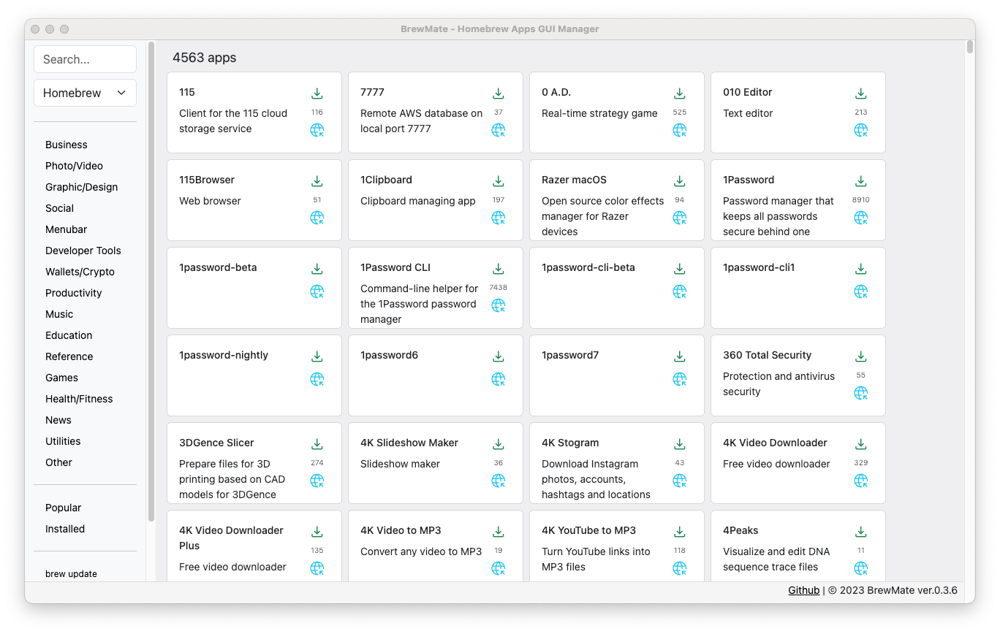

# BrewMate

**BrewMate - Homebrew GUI**

BrewMate is a macOS GUI application that makes it easy to search for, install, and uninstall Homebrew casks. You can also see the top downloaded casks for the last month.

# Status

Beta.

## Features

- [x] install casks
- [x] uninstall casks
- [x] brew update/upgrade
- [x] list installed
- [x] top downloads
- [x] show logs on install/uninstall
- [] fix scroll

# Install

1. Download the latest DMG file from the [releases page](https://github.com/romankurnovskii/BrewMate/releases).
2. Double-click the DMG file to open it.
3. Drag the BrewMate app to your Applications folder.
4. Launch BrewMate from your Applications folder.

or
```
brew install romankurnovskii/cask/brewmate --cask
```

or
```
brew tap romankurnovskii/homebrew
brew update
brew install brewmate --cask
```

# Screenshots




# Requirements

macOS 10.15 or later.

# Build

1. Clone the repository: `git clone https://github.com/romankurnovskii/BrewMate.git`
2. Install dependencies: `npm install`
3. Build the app: `npm run electron:build`
4. The built app will be located in the `dist` folder.


## Available Scripts in addition to the existing ones

### `npm run electron:dev`

Runs the app in the development mode.

The app will reload if you make edits in the `electron` directory.<br>
You will also see any lint errors in the console.

### `npm run electron:build`

Builds the app package for production to the `dist` folder.

Your app is ready to be distributed!

# Project directory structure

```bash
brewmate/
├── package.json
│
## render process
├── tsconfig.json
├── public/
├── src/
│
## main process
├── electron/
│   ├── main.ts
│   ├── menu.ts
│   ├── preload.ts
│   └── tsconfig.json
│
## build output
├── build/
│   ├── index.html
│   ├── static/
│   │   ├── css/
│   │   └── js/
│   │
│   └── electron/
│      └── main.js
│
## distribution packages
└── dist/
    ├── mac/
        └── BrewMate.app

```


# License

BrewMate is licensed under the MIT License. See the [LICENSE](LICENSE) file for details.
