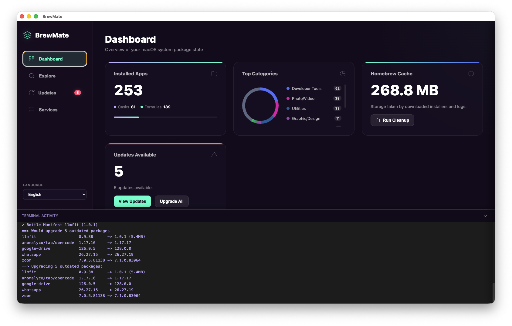

# BrewMate

**BrewMate - Homebrew GUI**

BrewMate is a GUI application for [Homebrew](https://brew.sh/) on **macOS** and **Linux**. Search, install, upgrade, and uninstall formulae and casks (where Homebrew supports them). You can also browse top downloads and manage brew services.

Includes third party apps + from [awesome-brew](https://github.com/romankurnovskii/homebrew-awesome-brew/)



## Features

- [x] install/uninstall casks
- [x] brew update/upgrade
- [x] list local installed
- [x] top installs
- [x] show logs on install/uninstall
- [x] Linux support (Homebrew / Linuxbrew; formula-primary)
- [ ] add 3rd party taps
- [ ] handle apps required sudo/pass on install/uninstall

## Prerequisites

Before you begin, ensure you have met the following requirements:

- **macOS** or **Linux** (Ubuntu 22.04+ / Debian-class recommended for Linux)
- **Homebrew**: Required on both platforms. Install with:

```sh
/bin/bash -c "$(curl -fsSL https://raw.githubusercontent.com/Homebrew/install/HEAD/install.sh)"
```

On Linux, use the official prefix `/home/linuxbrew/.linuxbrew` when possible (best bottle support). Follow the installer’s “Next steps” to add `brew` to your `PATH`.

### Linux system packages

For running Electron / building from source on Debian/Ubuntu:

```sh
sudo apt-get install build-essential procps curl file git \
  libgtk-3-dev libnotify-dev libnss3 libxss1 libasound2
```

# Install

### macOS — Option 1 (Homebrew cask)

```sh
brew install romankurnovskii/BrewMate/brewmate --cask
```

### macOS — Option 2 (DMG)

1. Download the latest DMG file from the [releases page](https://github.com/romankurnovskii/BrewMate/releases).
2. Double-click the DMG file to open it.
3. Drag the BrewMate app to your Applications folder.

### Linux (from source / local package)

Linux release artifacts may be produced with electron-builder (AppImage / `.deb`). From a clone:

```sh
npm install
npm run build:linux
```

Artifacts land in `dist-app/`. You can also run in development after `npm run build` with `npm start`.

> **Note:** On Linux, Homebrew is formula-primary. Casks are shown when available, but many macOS-only casks will not install. Interactive upgrades use the in-app terminal (external Terminal.app is macOS-only).

## First time launch (macOS)

1. Navigate to your "Applications" folder.
1. Find the app `BrewMate` and right-click on it.
1. Select "Open" from the context menu.
1. When the security warning appears, click "Open" to confirm that you want to open the app.
1. The app will now launch.

# Requirements

- macOS 10.15 or later, **or**
- Linux with Homebrew (Ubuntu 22.04+ recommended)

# Development / Build

1. Clone the repository: `git clone https://github.com/romankurnovskii/BrewMate.git`
2. Install dependencies: `npm install`
3. Build the app: `npm run build`
4. For **development** run `npm start` or `npm run start:dev`

## Build Types

### Local Test Build (macOS)

Build a version you can run and test on your Mac (direct distribution):

```bash
npm run build:mac
```

This creates a DMG in `dist-app/` that you can install and run locally.

### Local Test Build (Linux)

```bash
npm run build:linux
```

This creates AppImage and/or `.deb` packages in `dist-app/` (see `electron-builder.yml`).

### Mac App Store Build

Build a version for App Store submission (unsigned universal build):

```bash
npm run build:mas
```

This creates a PKG in `dist-app/` for App Store submission.

⚠️ **Important**: MAS builds **cannot be run locally** - they're only for App Store submission. If you need to test the app, use `build:mac` instead.

## Testing & Validation Workflow

Before submitting to the App Store:

1. **Test locally** (on your ARM Mac):

   ```bash
   npm run build:mac
   npm run test:local
   ```

2. **Build for App Store**:

   ```bash
   npm run build:mas
   ```

3. **Pre-submission validation**:

   ```bash
   npm run pre-submit
   ```

   This checks architecture, code signing, entitlements, and common rejection reasons.

4. **Upload to App Store Connect** via Transporter app

See [docs/BUILD_TYPES.md](docs/BUILD_TYPES.md) and [docs/SUBMISSION_CHECKLIST.md](docs/SUBMISSION_CHECKLIST.md) for more details.

## Available Scripts

### `npm run build:mac`

Builds the app for production with code signing (if certificates are available).

### `npm run test`

Runs the test suite using Jest.

### `npm run start:dev`

Runs the app in development mode with live reloading.

## CI/CD & Automation

BrewMate uses GitHub Actions for automated releases and App Store submission. For this to work, you must configure the following:

- [GitHub Repository Secrets](docs/GITHUB_SECRETS.md)

See [docs/BUILD_TYPES.md](docs/BUILD_TYPES.md) and [docs/SUBMISSION_CHECKLIST.md](docs/SUBMISSION_CHECKLIST.md) for more details.

# License

BrewMate is licensed under the MIT License. See the [LICENSE](LICENSE) file for details.
